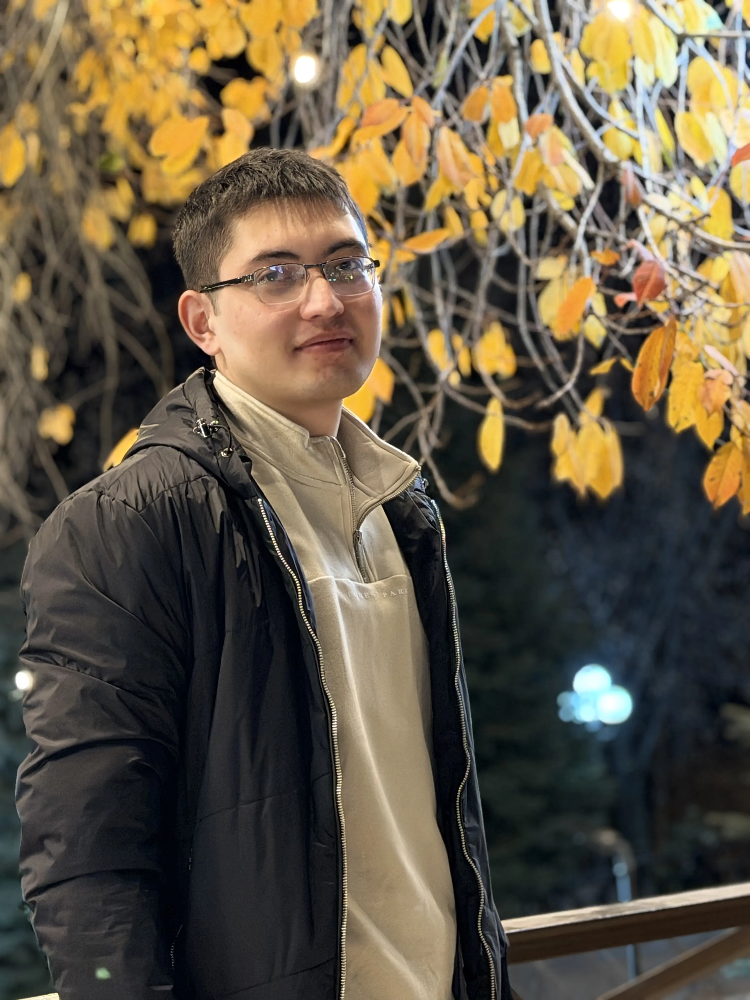

# Ecofin Web

Static landing page for Ecofin, built with plain HTML and CSS.

## Structure

```text
ecofin-web/
├── index.html
├── style.css
└── assets/
    ├── favicon.png
    └── images/
        ├── hojiakbar.webp
        └── axror.webp
```

## Preview

Open `index.html` directly in a browser, or run a small static server from this folder:

```bash
python3 -m http.server 4321
```

Then visit:

```text
http://127.0.0.1:4321
```

## Editing Content

Most page content is in `index.html`.

The site supports Uzbek, English, and Russian text using repeated elements with:

```html
class="i18n" data-lang="uz"
class="i18n" data-lang="en"
class="i18n" data-lang="ru"
```

When changing copy, update all three language versions where possible.

## Founder Images

Put founder photos in:

```text
assets/images/
```

Use relative image paths in the About section:

```html



```

Images are styled by `.team-photo` in `style.css` as 64px circular portraits.

## Styling

All visual styles are in `style.css`, including:

- Layout and responsive breakpoints
- Navigation
- Hero section
- Cards
- Sponsors and about sections
- Footer

No build step is required.
